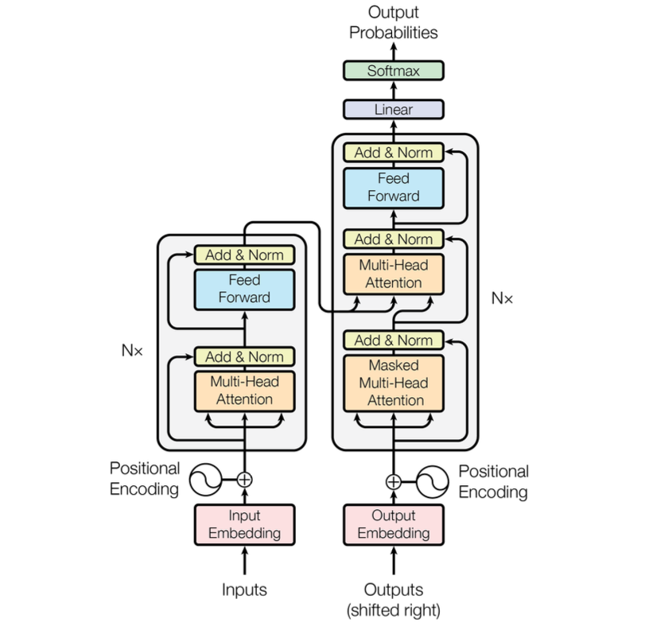

# GPT-Language-Model-From-Scratch

This repository contains an implementation of a character-level Transformer-based language model, inspired by the "Attention Is All You Need" paper (2017) and Andrej Karpathy's "Build LLM from Scratch" series. The model is a decoder-only architecture, following the original Transformer design while omitting the encoder. Future updates will incorporate insights from Sebastian Raschka's "Build LLM from Scratch" book.

---

<p align="center">
    
</p>

---

## Table of Contents

- [Introduction](#introduction)
- [Features](#features)
- [Requirements](#requirements)
- [Dataset](#dataset)
- [Usage](#usage)
- [Model Architecture](#model-architecture)
- [HyperParameters](#hyperparameters)
- [Future Improvements](#future-improvements)
- [References](#references)

## Introduction

This project implements a GPT-style language model from scratch using PyTorch. The model is trained on the Tiny Shakespeare dataset and operates at the character level. It generates text by predicting the next character in a sequence, leveraging self-attention and positional encoding to capture context.

## Features

- Character-level language modeling
- Decoder-only Transformer architecture
- Multi-head self-attention mechanism
- Positional embeddings
- Feedforward layers with ReLU activation
- Layer normalization
- Dropout for regularization
- Training using AdamW optimizer
- Ability to generate text given an initial context

## Requirements
Ensure you have the following installed:
- Python 3.x
- PyTorch
- NumPy
- Requests

To install dependencies, run:
```sh
pip install torch numpy requests
```

## Dataset
The model trains on the Tiny Shakespeare dataset. The script automatically downloads the dataset if it's not already present in the `data/` directory.

## Usage

Clone the repository and run the training script:

```sh
git clone https://github.com/your-repo-name.git
cd your-repo-name
python train.py
```

After training, it automatically generates text with:

```sh
context = torch.zeros((1,1), dtype=torch.long, device=device)
print(decode(model.generate(context, max_tokens=500)[0].tolist()))
```

## Model Architecture

This implementation follows the decoder-only architecture of the Transformer model:

1. **Token and Positional Embeddings**: Converts input characters into dense vector representations.
2. **Self-Attention Mechanism**: Computes attention weights to capture dependencies between tokens.
3. **Multi-Head Attention**: Splits the embeddings into multiple heads to learn different relationships.
4. **Feedforward Network**: Processes the attended embeddings through two linear layers with ReLU activation.
5. **Layer Normalization & Dropout**: Stabilizes training and prevents overfitting.

### Transformer Block Diagram

Below is the transformer architecture used in this implementation:

## Hyperparameters
The script defines the following hyperparameters:
```sh
batch_size = 32
block_size = 128
max_iters = 5000
eval_interval = 300
learning_rate = 3e-3
n_embd = 256
n_head = 6
n_layer = 6
dropout = 0.2
device = "mps" if torch.backends.mps.is_available() else "cpu"
```
Adjust these values as needed to optimize training.

## Future Improvements

- Implement Byte-Pair Encoding (BPE) for subword tokenization.
- Introduce rotary embeddings instead of learned positional embeddings.
- Experiment with larger datasets for improved text generation.
- Add temperature scaling for more diverse text generation.
- Implement FlashAttention for faster training.

## References

- Vaswani et al., "Attention Is All You Need" (2017)
- Andrej Karpathy's "Build LLM from Scratch" YouTube series
- Sebastian Raschka's "Build LLM from Scratch"
- PyTorch documentation

## License
This project is open-source under the MIT License.
